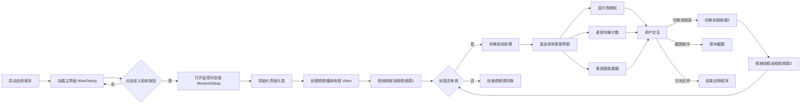
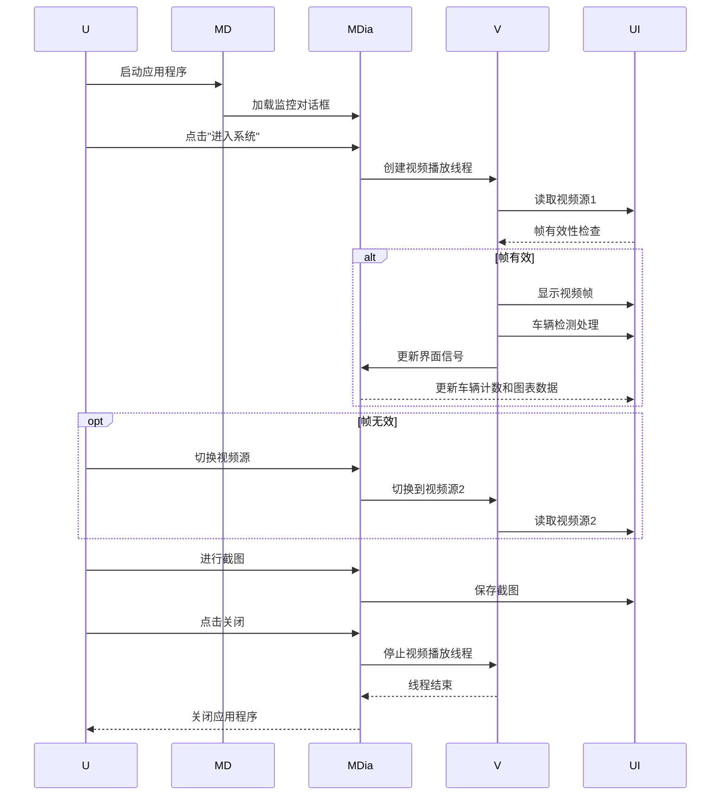

# 项目介绍

> [Work](https://github.com/aicaipig/work)，是一个基于 `PyQt5`,`opencv`和 `百度api`设计开发的车流量检测系统，项目持续更进中...

## 功能介绍

**监控**：实时监控不同路段，目前只有两个视频可作为视频源。[Work](https://github.com/aicaipig/work)**绝不窥测用户个人隐私，可放心使用**，但实际上opencv可以简单实现对于主机设备的使用，部分功能仍在开发🚧，敬请期待。

**源流切换**：默认为视频2模式，可通过 ``⌘-⇧-yuan1``和 ``⌘-⇧-yuan2``进行切换；

**窗口点击**：项目添加了针对于 `Label`相应点击事件，在点击 `Label`实例主体 `video1`时打开详情窗口，后续功能仍在开发；

**实时流量**：项目有关于 `实时车流量`的折线绘制，可以更加直观的监视流量变化，百度api调用次数有限制，更新速度 `2times/s`；

**截图**：项目添加实时 `截图`的功能。

## 使用场景

*[Work](https://github.com/aicaipig/work)有简单车流量实时监视和截图功能。可以辅助监视从而实现红绿灯时间的潮汐变化*。

## 4. [流程图](https://github.com/knsv/mermaid#flowchart)

## 5. [序列图](https://github.com/knsv/mermaid#sequence-diagram)

## 技术结构

* **UI层** : 使用PyQt5构建界面，包括主窗口和监控窗口。
* **视频处理** : 使用自定义的 `Video` 类管理视频线程，实现视频流的播放和切换。
* **数据可视化** : 使用 `QChart` 和 `QLineSeries` 实现实时折线图，显示车辆数量。
* **交互功能** : 提供按钮和事件处理，允许用户进行界面切换和截图操作。

## 项目截图

[截图1](https://github.com/aicaipig/work/blob/main/jietu/%E6%88%AA%E5%9B%BE%202024-07-06%2017-06-30.png) ;[截图2](https://github.com/aicaipig/work/blob/main/jietu/%E6%88%AA%E5%9B%BE%202024-07-06%2017-06-55.png)

## 总结

**该系统通过将后台事件处理与界面UI及响应分离，实现了对人车监控的基本需求，并提供了良好的用户交互体验。UI文件负责界面的布局和用户交互，Frame文件负责处理后台逻辑和事件响应。**

